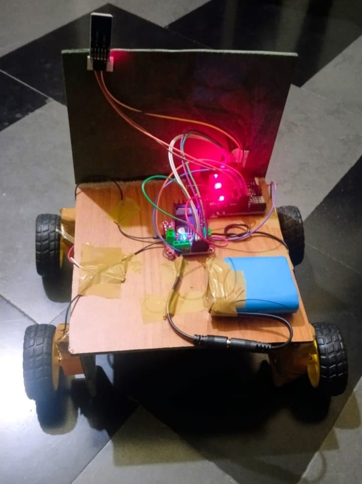

# ♿ Bluetooth-Controlled Wheelchair Prototype

<p align="center">
  
</p>

<p align="center">
  <b>A Bluetooth-based mobility prototype controlled using Arduino Uno and an HC-05 Bluetooth module.</b>
</p>

<p align="center">
  
  
  
  
  
</p>

---

## 📌 About the Project

The **Bluetooth-Controlled Wheelchair Prototype** is an embedded systems project designed to demonstrate wireless control of a four-wheel mobility platform.

The system uses an **Arduino Uno** as the main controller. An **HC-05 Bluetooth module** receives movement commands from a smartphone through the **Serial Bluetooth Terminal application**.

The received commands are processed by the Arduino and used to control the motors through an **L298N motor driver**.

The prototype supports:

- ⬆️ Forward movement
- ⬇️ Backward movement
- ⬅️ Left movement
- ➡️ Right movement
- 🛑 Stop

> **Note:** The smartphone application used in this project is the **Serial Bluetooth Terminal** app. No custom mobile application was developed for this project.

---

## 🎯 Project Objective

The main objective of this project is to develop a simple and low-cost wireless mobility control system using:

- Arduino Uno
- HC-05 Bluetooth module
- L298N motor driver
- DC geared motors
- Battery power supply

The project demonstrates the practical application of:

**Bluetooth Communication → Microcontroller → Motor Driver → DC Motors**

---

## ⚙️ System Architecture

```text
              Smartphone
                   │
                   │ Bluetooth
                   ▼
        ┌─────────────────────┐
        │      HC-05          │
        │ Bluetooth Module    │
        └──────────┬──────────┘
                   │ Serial Communication
                   ▼
        ┌─────────────────────┐
        │     Arduino UNO     │
        │   Main Controller   │
        └──────────┬──────────┘
                   │
                   │ Control Signals
                   ▼
        ┌─────────────────────┐
        │      L298N          │
        │    Motor Driver     │
        └──────────┬──────────┘
                   │
             Motor Control
                   │
          ┌────────┴────────┐
          ▼                 ▼
     DC Motors         DC Motors


