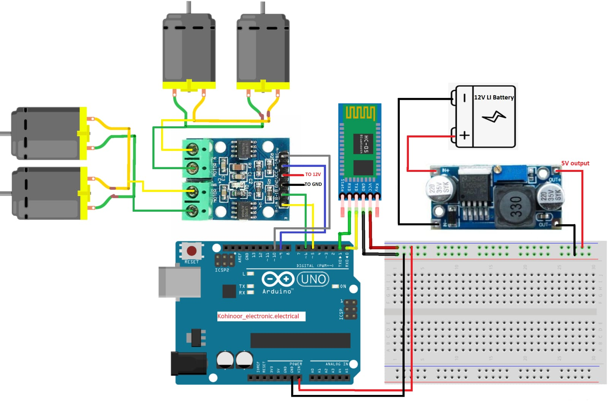

# 🚼 Bluetooth-Controlled Wheelchair Prototype

<p align="center">
  
</p>

<p align="center">
  <b>Arduino-based Bluetooth-controlled mobility prototype using Arduino Uno, HC-05 Bluetooth module and L298N motor driver.</b>
</p>

<p align="center">
  
  
  
  
</p>

---

## 📌 Project Overview

The **Bluetooth-Controlled Wheelchair Prototype** is an embedded systems project designed to demonstrate wireless movement control of a four-wheel mobility platform.

The system uses an **Arduino Uno** as the main controller. An **HC-05 Bluetooth module** receives commands wirelessly from a smartphone. The Arduino processes these commands and controls the motors through an **L298N motor driver**.

### 🚀 Supported Movements

- ⬆️ Forward
- ⬇️ Backward
- ⬅️ Left
- ➡️ Right
- 🛑 Stop

---

## ✨ Features

- 📱 Bluetooth-based wireless control
- 🤖 Arduino Uno microcontroller
- ⚙️ L298N dual H-bridge motor driver
- 🔋 DC motor-based mobility
- 🎮 Smartphone command control
- 🔄 Forward and reverse movement
- ↩️ Left and right turning
- 🛑 Stop control

---

## 🧩 Components Used

| Component | Purpose |
|---|---|
| Arduino Uno | Main microcontroller |
| HC-05 Bluetooth Module | Wireless communication |
| L298N Motor Driver | Motor control |
| DC Motors | Wheel movement |
| Battery | Power supply |
| Wheelchair Prototype Frame | Mechanical platform |
| Jumper Wires | Electrical connections |

---

## 🔌 Circuit Diagram

<p align="center">
  
</p>

### 🔗 System Connection

```text
        📱 Smartphone
              │
              │ Bluetooth
              ▼
        ┌─────────────┐
        │    HC-05    │
        │  Bluetooth  │
        └──────┬──────┘
               │ Serial
               ▼
        ┌─────────────┐
        │ Arduino Uno │
        │ Controller  │
        └──────┬──────┘
               │
               │ Control Signals
               ▼
        ┌─────────────┐
        │    L298N    │
        │ Motor Driver│
        └──────┬──────┘
               │
          ┌────┴────┐
          ▼         ▼
      DC Motors   DC Motors
          │         │
          └────┬────┘
               ▼
       🦽 Wheelchair
          Movement

